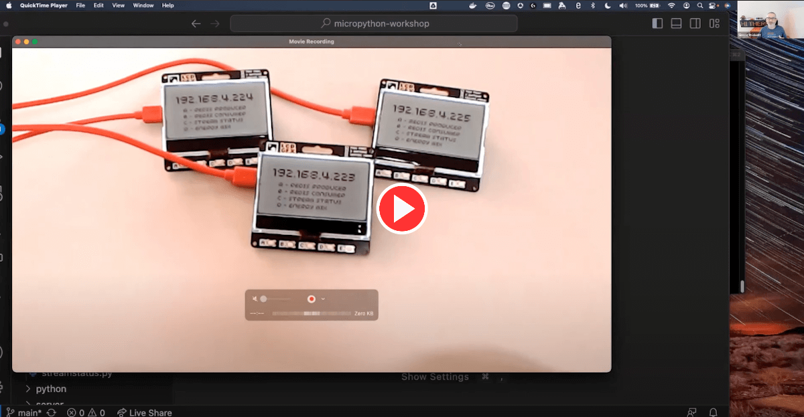

# Redis MicroPython Workshop with Raspberry Pi Pico W and Pimoroni GFX Pack


This is the repository for my Redis Streams / Raspberry Pi Pico W / MicroPython workshop!

In this workshop you'll learn about Redis Streams, MicroPython, how to call an API from a Raspberry Pi Pico W and how to display text and graphics and capture user input from the GFX Pack screen.

If you don't have the hardware, you can run equivalent desktop Python scripts and still learn about Redis Streams and some cool tricks for displaying information in the terminal using the ["rich"](https://pypi.org/project/rich/) module for Python.

I've taught this workshop in person and also delivered it as a sort of talk online.  Check out the video of my talk about it that I gave to the Melbourne MicroPython Meetup Group.  It's on the official MicroPython YouTube channel!

[](https://www.youtube.com/watch?v=tP6DDbgesnc)

Interested in having me deliver this workshop for your group?  [Get in touch](https://simonprickett.dev/contact/).  Want to learn more about Redis Streams?  Try the [free online course](https://university.redis.com/courses/ru202/) at Redis University.

## Slides

The slides that accompany this workshop are contained in this repository:

* [Slides in Apple Keynote format](slides/micropython_workshop_slides.key).
* [Slides in PDF format](slides/micropython_workshop_slides.pdf).

## Hardware Bill of Materials


Each student or pair of students at the workshop should have access to a kit containing:

* [Raspberry Pi Pico W with headers pre-soldered](https://shop.pimoroni.com/products/raspberry-pi-pico-w?variant=40454061752403) (required) - £7.20.
* [Pimoroni GFX Pack](https://shop.pimoroni.com/products/pico-gfx-pack?variant=40414469062739) - a display with buttons and multi-coloured backlight (required) - £16.50.
* [USB A to micro USB data/charge cable](https://shop.pimoroni.com/products/usb-a-to-microb-cable-red?variant=32065140746) (required - use one you have already perhaps?) - £3.00.
* [Pimoroni large loot box](https://shop.pimoroni.com/products/pirate-brand-plastic-loot-box?variant=40286342922) (optional but looks cool and keeps everything organized) - £3.30.

At the time of writing one kit including all of the above costs £30.00 plus postage at Pimoroni.

The GFX pack is a great start point for a workshop like this, and can also be expanded with a Stemma/QT cable and a range of sensors or other inputs (see the "Connecting Breakouts" section [here](https://shop.pimoroni.com/products/pico-gfx-pack?variant=40414469062739)).

## Workshop Overview

In this workshop, students will learn how to model a hotel room service / front desk task tracking system with Redis Streams.  For example a "job" might be cleaning in room 203, take extra towels to room 404 or order a taxi for room 12.

You'll use the Raspberry Pi Pico W with GFX Pack to connect to a central Redis database.  MicroPython code on the Pico W presents an interface allowing users to create new jobs, perform exising jobs and monitor the overall flow of jobs through the system.  You'll learn how Redis manages the allocation of jobs to workers.

You'll also explore functionality to call an API endpoint from the Pi Pico W and display the resulting data as a graph on the screen.  For this, you'll use the [UK Carbon Intensity API](https://www.carbonintensity.org.uk/).

## Software Prerequisites

To get the most from this workshop, please install the following software **beforehand** to save time and network bandwidth during the event:

* The [Thonny IDE](https://thonny.org/) - this is a code editor designed to work with MicroPython and the Pico W (amongst many other microcontrollers).
* Optional, but recommended: [RedisInsight](https://redis.com/redis-enterprise/redis-insight/) - a graphical tool for managing Redis databases.  On macOS you can also get RedisInsight from the App Store directly.
* [Python 3](https://www.python.org/downloads/) - check your machine has a recent Python 3 installed (`python3 --version`).  We've tested the desktop code for this workshop using Python 3.10 on macOS Ventura.

## Starting Redis

The workshop uses a single instance of Redis, to which all of the Raspberry Pi Pico Ws connect.  There are two ways to start an appropriate Redis instance... your instructor will usually do this for you and provide you with shared Redis credentials for the session.

If you want to lead a workshop, use either of the following methods to get yourself an appropriate Redis instance.

### Get a Free Redis Cloud Instance

Use this option when the wifi at the workshop venue is a simple SSID/passphrase configuration.  This allows the Raspberry Pi Pico Ws to connect to the internet and reach a cloud instance of Redis.

Get a free Redis Cloud Instance [here](https://redis.com/try-free/) and note the host, port and password as you'll need those to configure other components later.  Use RedisInsight to connect to the database, and run the following command at the CLI:

```
XGROUP CREATE jobs staff 0 MKSTREAM
```

Redis should respond with `OK`.  Your cloud Redis instance is now ready to use!

### Docker

Use this option when the wifi at the workshop venue uses a captive portal.  You'll also need to ensure that port 6379 is open on the machine that you're running Redis on, and that the wifi configuration permits this.  I avoid this complication by bringing my own travel router (I have [this one](https://www.gl-inet.com/products/gl-mt1300/) - others are available) - effectively providing my own internal wifi when the venue doesn't have a simple SSID/password wifi connection.

Using Docker desktop and the `docker-compose.yml` file provided:

```
docker-compose up
```

This will start a Redis instance on `localhost:6379`.  You will need to remember the IP address of the machine that Redis is running on and the Redis port number (6379) when configuring other components.

Before running any other components, you need to create a Redis Streams Consumer Group.  Do so by running the `redis-cli` tool in your container like so:

```
docker exec -it redis-micropython-workshop redis-cli
```

You should see a prompt that looks like this:

```
127.0.0.1:6379>
```

At this prompt enter the following command:

```
XGROUP CREATE jobs staff 0 MKSTREAM
```

Redis should respond with `OK`.  Then enter the command `QUIT` to return to your terminal prompt.

Redis is now set up and running!

## Next Steps

You should now read the README files in the various folders in this repository:

* [`micropython`](micropython/README.md) - The MicroPython software that runs on the Raspberry Pi Pico W.
* [`python`](python/README.md) - Desktop Python alternatives that perform the same tasks as the MicroPython code.
* [`server`](server/README.md) - A server that displays Redis Stream overview information in a web front end, and which can also act as a fake data generator for the carbon intensity functionality in environments where connecting the Raspberry Pi Pico W to the internet is not practical (example: wifi with a [captive portal](https://en.wikipedia.org/wiki/Captive_portal)).

Want to learn more about Redis Streams?  Sign up for the free [RU202: Redis Streams course](https://university.redis.com/courses/ru202/) at Redis University.
