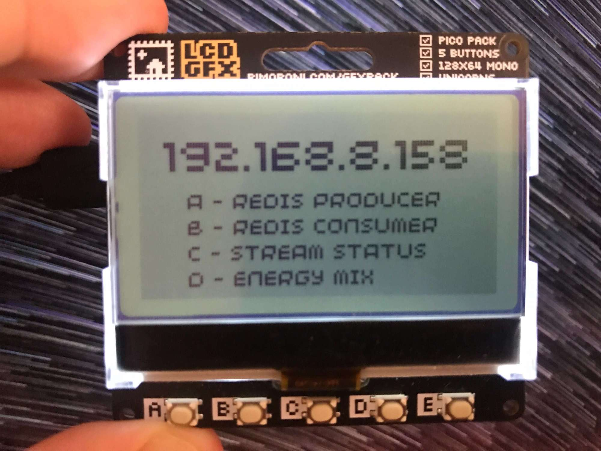

# MicroPython Workshop: Raspberry Pi Pico W Component



## Overview

This component is written in MicroPython and runs on the Rasperry Pi Pico W hardware with the Pimoroni GFX Pack display.

It connects to the Redis database running elsewhere for the Streams functionality and also contains a demonstration of how to call an API and display the results graphically.  This latter functionality doesn't use Redis.

## Prerequisites

To get this component up and running you'll need:

* A [Raspberry Pi Pico W with the headers attached](https://shop.pimoroni.com/products/raspberry-pi-pico-w?variant=40454061752403) (buy one pre-soldered or solder [headers](https://shop.pimoroni.com/products/pico-header-pack?variant=32374935715923) on yourself).  If you are using a Pico W that your instructor provided, it will already have [Pimoroni MicroPython](https://learn.pimoroni.com/article/getting-started-with-pico) installed.  This is necessary to get the drivers for the GFX Pack.  If you have a fresh out of the box Pico W you'll need to install [Pimoroni MicroPython](https://learn.pimoroni.com/article/getting-started-with-pico) on it before going further.
* A [Pimoroni GFX Pack](https://shop.pimoroni.com/products/pico-gfx-pack?variant=40414469062739) (all in one display with buttons and coloured backlight).  This presses onto the Pico W headers for a no soldering required connection.
* A [USB to micro USB data/power cable](https://shop.pimoroni.com/products/usb-a-to-microb-cable-red?variant=32065140746).  Make sure your cable handles data, not just power!
* The [Thonny IDE](https://thonny.org/) installed on your machine so that you can view/edit and load code onto the Pico W.

## Setup and Configuration

If your Pico W / GFX Pack was provided to you by your instructor, then the software will already be loaded up and mostly ready to go.  You may have to configure some wifi network credentials in the `secrets.py` file - ask your instructor.

Open the Thonny IDE, then open the `picow` folder from this repository in Thonny.

Open the file `secrets.py` and make sure that the following parameters are set to the values that your instructor provided (or to your wifi credentials if you're using this alone):

```python
WIFI_SSID = "simonberyl"
WIFI_PASSWORD = "goodlife"
REDIS_HOST = "192.168.8.245"
REDIS_PORT = 6379
REDIS_USER = ""
REDIS_PASSWORD = ""
CARBON_INTENSITY_URL = "http://192.168.8.245:5000/regional/postcode/OX1"
```

Save your changes.

Now, connect the Pico W to your machine using the USB to Micro USB cable.  Select the correct device in Thonny (bottom right - ask your instructor if needed) then press the Stop button in the ribbon towards the top of the Thonny window.

If you made changes to `secrets.py`, right click the file and select "Upload to /" from the menu that appears.

If your device didn't have the software pre-installed, select ALL `.py` files, right click then select "Upload to /" from the menu that appears.

Restart the device by pressing the Reset button on the rear of the GFX Pack.

Hopefully the device will boot, connect to the network and display a menu.  If it fails to do this, check in with your instructor for help.

The software on the device performs four distinct tasks, which are described in the following sections...  Use buttons A-D on the GFX pack to access each.  

The code for the menu screen / startup process is contained in the `main.py` file.

## The Producer (Button A)

TODO

The code for this screen is contained in the `producer.py` file.

## The Consumer (Button B)

TODO

The code for this screen is contained in the `consumer.py` file.

## The Stream Status Display (Button C)

TODO

The code for this screen is contained in the `streamstatus.py` file.

## Carbon Intensity Display (Button D)

TODO

The code for this screen is contained in the `carbonintensity.py` file.